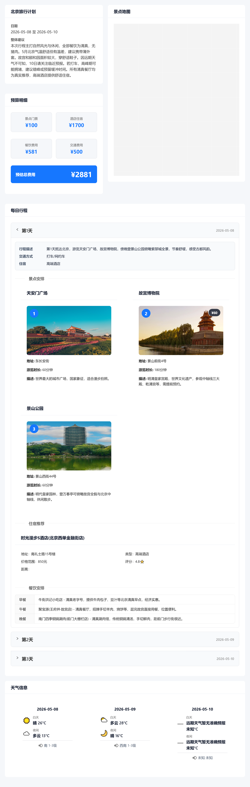

# LangGraph Trip Planner

一个可观察规划过程、保存历史并从检查点手动恢复的单城旅行助手。后端通过 LangChain 接入模型，以 LangGraph 编排资料采集、结构化生成、校验、重试和候选选择；前端使用 Vue 3 展示行程、预算、天气与地图。

本项目只有在线推理，不包含模型后训练、训练数据、LoRA 权重或本地训练服务。

当前开发方式是 **WSL2 Ubuntu + 非 root 开发容器 + 共享本地 PostgreSQL**。前端、后端和数据库在本机运行，账号不依赖 Supabase；模型和高德仍是外部 API，可能需要联网和付费。这里没有公网部署，也不要求在 Windows 全局安装 Python、Node 或数据库服务。

## 从哪里开始

| 你要做什么 | 阅读入口 |
| --- | --- |
| 第一次安装或日常启动、停机、备份、排错 | [本地隔离开发手册](docs/LOCAL_DEV_GUIDE.md) |
| 理解请求、模型、数据库和 SSE 如何协作 | [架构设计](docs/ARCHITECTURE.md) |
| 找到功能对应的源码文件 | [项目目录](PROJECT_STRUCTURE.md) |
| 准备项目介绍与面试问答 | [面试讲解指南](docs/INTERVIEW_GUIDE.md) |
| 查看真实浏览器验收方式、结果与限制 | [浏览器验收记录](docs/BROWSER_ACCEPTANCE.md) |
| 修改主题、布局和交互风格 | [界面设计说明](docs/UI_DESIGN.md) |
| 维护开放时间、官方预约来源与攻略入口 | [景点实用信息说明](docs/VISIT_INFO.md) |

[本地环境执行记录](docs/LOCAL_DEV_EXECUTION.md) 保留历史验收日期与当次结果，不代表当前所有功能的最新测试数量。

## 主要能力

- 通过模型网关支持已安装的 LangChain Chat Model 集成；默认包含 DeepSeek 和 OpenAI，其他供应商按需安装。兼容入口不等于所有模型均已实测。
- 从高德与本地候选表获取景点、酒店、餐厅和天气，减少模型自由编造。
- 使用统一 `TripPlan` Pydantic Schema，并按模型能力在 JSON Schema、工具调用、JSON Mode 和提示词 JSON 之间降级。
- LangGraph 显式管理失败重试、校验反馈、多候选 Rerank 和确定性 fallback。
- 返回供应商、模型、结构化策略、尝试次数和 Token usage 等可观测元数据。
- Vue 页面展示每日行程、地图、天气与预算，并支持导出。
- 本地邮箱标识＋密码登录；账号侧边栏支持历史、新增、重命名、删除，编辑结果保存到本地数据库。
- SSE 展示真实 LangGraph 节点和模型调用状态；断线重放，刷新不重复发起规划。
- 本地 PostgreSQL Checkpointer 支持中断后手动恢复，日志可按请求/行程/运行编号定位。
- 景点图片按地点身份匹配；结果页异步展示高德开放时间参考、已核验官方入口和第三方攻略入口，查询失败不阻塞行程与地图。
- 门票显示为预算估算，不是实时票价；估算为零不代表已确认免费。没有自动预约、实时余票或自动闭馆日期校验。

## 原有表单与结果界面预览

下方保留早期界面截图作为历史参考，不代表当前旅行手账主题、账号侧栏与进度面板。当前界面设计见上方文档导航。




## 架构

```text
Vue 3
  → 本地账号登录，携带 HttpOnly Cookie（修改请求额外带 CSRF）
  → FastAPI POST /api/trips（立即返回行程 ID）
  → GET /api/trips/{id}/events（SSE 实时进度与重放）
  → 后台 RunManager + PostgreSQL 业务表
  → LangGraph StateGraph
      → collect_context     高德景点/餐饮/酒店/天气
      → build_prompt        压缩 PlannerContext
      → generate_candidate  LangChain BaseChatModel
      → validate_candidate  Schema + 日期 + POI + 业务规则
      ↘ retry               带校验错误重新生成
      → select_best_candidate  多候选确定性 Rerank
      ↘ create_fallback        无合法候选时生成基础兜底
  → PostgreSQL Checkpointer 保存节点状态
  → TripPlan + model_metadata 写入历史行程
```

`retry` 是返回 `generate_candidate` 的条件边，不是独立节点。模型对象和外部服务通过 LangGraph runtime context 注入，图节点不导入供应商专用模型类。照片、开放时间与攻略入口属于结果展示链路，不加入规划模型上下文。

## 技术栈

- 后端：Python 3.11–3.13（开发容器固定 3.13）、FastAPI、LangChain、LangGraph、Pydantic、httpx、uv
- 默认模型集成：`langchain-deepseek`、`langchain-openai`
- 可选模型集成：Anthropic、Google GenAI、Ollama
- 前端：Node 24（开发容器）、Vue 3、TypeScript、Vite、Ant Design Vue、高德地图 Web JS API
- 持久化：PostgreSQL 17、SQLAlchemy、Alembic、LangGraph PostgreSQL Checkpointer
- 测试：pytest、Fake Chat Model、Vitest；浏览器验收范围另见验收记录

## 本地隔离环境快速开始

先在 Docker Desktop 中开启 Ubuntu 集成，首次配置按[完整手册](docs/LOCAL_DEV_GUIDE.md)执行 `setup` 和 `pin-images`。已完成首次配置的电脑，每天在 **Ubuntu 终端**执行：

```bash
cd ~/dev/projects/langgraph-trip-planner
python3 scripts/dev.py start
```

`start` 启动数据库和开发容器、安装锁定依赖，**不会自动启动前后端进程**。密钥在 `~/dev/config/trip-backend.env`、`trip-frontend.env`；专用数据库密码由脚本生成，不提交 Git。

VS Code 打开 Linux 项目后选择 **Dev Containers: Reopen in Container**，在“终端 → 运行任务”依次运行“数据库迁移”（首次或迁移更新后）、“启动后端（含日志）”“启动前端”。项目在容器内的路径是 `/workspace`。不要复制旧 Windows 的 `.venv` 或 `node_modules`。

- 界面：`http://127.0.0.1:5173`
- 健康检查：`http://127.0.0.1:8000/health`，应看到 `storage_ready=true`；HTTP 200 但 `degraded` 不算就绪。该接口不是每次实时探测数据库的完整健康检查。
- API 文档：`http://127.0.0.1:8000/docs`
- 日志：Linux 项目 `backend/logs/app.log` 和 `error.log`
- 只关项目：`python3 scripts/dev.py stop-trip`；结束全部开发使用需确认的 Windows 脚本，详见手册。

统一从 `127.0.0.1` 访问，不与 `localhost` 混用，否则 Cookie 按主机隔离可能导致登录问题。容器内监听 `0.0.0.0` 用于端口映射，对宿主机只发布回环端口；不代表已公开上线。

## 切换模型

在 `~/dev/config/trip-backend.env` 中只选择一套配置。`LLM_MODEL` 填供应商实际允许调用的模型 ID；同时匹配 `LLM_API_KEY`、`LLM_BASE_URL`，不要混用上一家服务的 Key 和地址。

| 服务类型 | `LLM_PROVIDER` | 开发容器内需要的集成 |
| --- | --- | --- |
| DeepSeek | `deepseek` | 已包含 |
| OpenAI | `openai` | 已包含 |
| OpenAI-compatible 服务 | `openai_compatible` | 已包含；填写该服务文档指定的兼容地址 |
| Claude | `anthropic` | 在 `/workspace/backend` 执行 `uv sync --locked --extra anthropic` |
| Gemini | `google_genai` | 在 `/workspace/backend` 执行 `uv sync --locked --extra google` |
| 其他 LangChain 集成 | 对应 provider 标识 | 先安装并锁定所需集成，再验证该模型的参数和结构化输出能力 |

更改后端环境配置后重启后端；通过 Compose 注入的变量需要重建对应容器才能更新。使用可选集成时，后续 `uv sync` 和 `uv run` 都需携带对应 extra，避免同步时被移除。例如 Claude 用 `uv run --locked --extra anthropic python run.py` 启动；默认 VS Code 后端任务不含 extra，需选择对应命令或调整任务。具体供应商有额外认证要求时，不能只改模型名。

`LLM_MODEL_KWARGS` 接收 JSON 对象，只填写该集成支持的私有参数，不是跨供应商通用选项。`LLM_STRUCTURED_OUTPUT_MODE=auto` 按供应商能力选择兼容策略；超时、流式进度和图重试的含义见[架构设计](docs/ARCHITECTURE.md)。本项目不要求运行本地模型服务。

## 测试与构建

在 **开发容器终端**执行：

```bash
cd /workspace/backend
uv run --locked pytest

cd /workspace/frontend
npm test
npm run build
```

上述默认测试模拟模型和高德响应，不消费真实 API；它们不等于真实浏览器或正式 PostgreSQL 全链路验收。真实 PostgreSQL 验收另在 Ubuntu 项目目录运行 `python3 scripts/dev.py verify-postgres`，使用独立 `test_*` 数据库；未提供测试数据库时对应 pytest 项会明确跳过，不能算通过。

浏览器测试的环境、实际检查项及局限见[浏览器验收记录](docs/BROWSER_ACCEPTANCE.md)。隔离测试服务只用于验收，不应替换日常 PostgreSQL 启动流程。真实模型行程由用户主动提交验收。

## API

- `GET /api/auth/session`：查询本地会话，获取页面所需的 CSRF 信息
- `POST /api/auth/register`、`POST /api/auth/login`：本地邮箱标识＋密码注册／登录
- `POST /api/auth/logout`：撤销当前会话
- `POST /api/trips`：创建后台任务，返回 202；要求已登录 Cookie、CSRF／Origin 校验及 `X-Idempotency-Key` UUID
- `GET /api/trips`、`GET /api/trips/{id}`：自己的历史列表与详情
- `GET /api/trips/{id}/events`：SSE 进度，支持 `Last-Event-ID`
- `POST /api/trips/{id}/resume`：从持久化检查点手动继续
- `PATCH /api/trips/{id}`、`DELETE /api/trips/{id}`：重命名、删除
- `PUT /api/trips/{id}/plan`：带 revision 的编辑保存
- `GET /api/me/usage`：当前用户当天额度与活跃任务
- 旧 `POST /api/trip/plan` 已返回 410，不能绕过账号和额度创建任务
- `GET /api/map/poi`：搜索POI
- `GET /api/map/weather`：查询天气
- `POST /api/map/route`：规划路线
- `GET /api/poi/detail/{poi_id}`：获取POI详情
- `GET /api/poi/photo`：获取景点图片
- `GET /api/poi/visit-info`：查询景点开放时间参考及已核验官方来源

行程、地图和景点业务接口都要求登录。修改请求额外要求允许的 Origin 和 `X-CSRF-Token`；SSE 通过 Cookie 认证，并支持 `Last-Event-ID` 重放。

## 安全

- 所有密钥只放在本地或部署平台环境变量中。
- `.env`、虚拟环境、`node_modules`、日志和缓存均被Git忽略。
- 账号密码使用 Argon2id；服务端仅保存随机会话令牌的哈希。Cookie 为 HttpOnly、SameSite=Strict，本地 HTTP 默认不强制 Secure。会话有效期 7 天，退出立即撤销。
- 邮箱只是本地账号标识，不代表邮箱所有权已验证；暂无邮件找回密码或 GitHub 登录，也没有默认账号或匿名绕过。
- 业务查询显式绑定当前用户 ID。数据库业务表启用 RLS、没有浏览器访问策略；应用使用本项目数据库 owner，用户级隔离依靠后端鉴权和查询过滤，不能把 RLS 描述为应用连接自动隔离用户。
- 模型 Key 和后端高德 Web 服务 Key 不发送给浏览器；浏览器地图 SDK 使用单独的 Web 端配置。检查点和业务历史包含行程内容，备份也属于隐私数据。日志不记录完整提示词、模型正文和密钥，但不能把日志脱敏等同于数据库不保存内容。
- 当前仅面向本地单进程运行，不是上线部署方案。新增部署前仍需独立审视全站限流、预算、备份、监控和域名/CORS。

## 已知边界

- 规划针对一个明确城市，不是跨省多城市调度或完整地理编码服务。
- Checkpointer 恢复到图节点边界；中断中的模型请求可能重跑并再次计费。SSE 重连不是继续模型正文，也不是修复数据库连接。
- 规则校验与候选重排用于减少错误，不保证实地营业、价格、路程与可预约性。最终出行前仍须核验官方公告。
- 模型 metadata 的 usage 是供应商返回的调用信息，不是所有尝试累计计费账单。没有生产负载测试或分布式队列能力的声明。

## 数据来源

- [高德开放平台](https://lbs.amap.com/)
- 景区官方来源登记表与维护流程见 [景点实用信息说明](docs/VISIT_INFO.md)；攻略平台只提供外部访问入口，不抓取笔记或评论。
