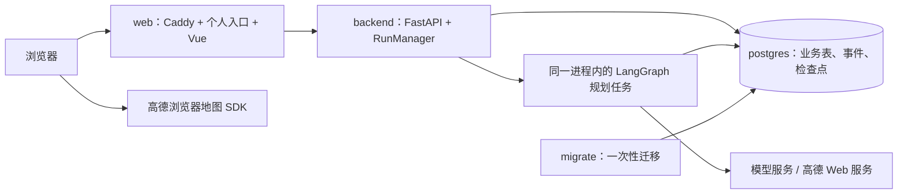

# 单机云服务器部署与维护

## 在线入口与当前状态

- 个人作品集：[http://8.163.48.116](http://8.163.48.116/)。
- 旅行项目：[http://8.163.48.116/trips/new](http://8.163.48.116/trips/new)。
- 首页按钮进入旅行项目；未登录时跳转到登录页，访客可以自行注册。邮箱仅作为账号标识，不发送验证邮件。
- 2026-09-08 部署到阿里云 ECS，Ubuntu 22.04，2 vCPU、40 GiB 磁盘；系统可见内存约 3.4 GiB。部署目录为 `/opt/trip-planner`。
- 当前发布标识为 `20260908-03`。前端包含个人入口和 HTTP 提交兼容修复；后端沿用 `20260908-01` 的镜像内容，并已建立新发布标签。
- 当前使用 HTTP 公网 IP，没有域名和 HTTPS。HTTP 不提供传输加密；Cookie 的 `Secure` 属性在此配置下关闭。此记录只说明验收时可访问，不保证地址、实例或云平台策略长期不变。

这是一套作品集用的单机部署。容器自动重启、数据持久化和备份提高可恢复性，不能替代多机高可用。

## 容器如何协作



| Compose 服务 | 常驻 | 职责与边界 |
| --- | --- | --- |
| `web` | 是 | Caddy 提供个人入口与编译后的 Vue 文件，将 `/api/*`、`/health*` 转发给后端；SSE 及时刷新 |
| `backend` | 是 | 一个 Uvicorn 进程处理 API，RunManager 用 asyncio 后台任务运行 LangGraph；规划 Worker 是逻辑职责，没有独立 Worker 容器 |
| `postgres` | 是 | 保存账号、会话、行程、运行记录、SSE 事件及 `planner_internal` 检查点 |
| `migrate` | 否 | 先执行 Alembic，再初始化 Checkpointer 表；成功退出后后端才启动 |

运行顺序为 PostgreSQL 健康 → migrate 成功 → backend 就绪 → web 启动。每次显式执行 `manage.sh up` 时 Compose 会检查这些依赖；日常进程重启不会重复构建镜像。

`proxy` 网络连接 web/backend，`database` 是连接 backend/migrate/postgres 的内部网络。数据库和 API 没有发布宿主机端口，浏览器不能直接连接 PostgreSQL。默认规划并发上限为 2；这不是经过压测的吞吐保证。

## 发布文件与配置

| 文件 | 用途 |
| --- | --- |
| [compose.prod.yaml](../compose.prod.yaml) | 服务、网络、持久卷、健康检查、内存和日志限制 |
| [deploy/backend.Dockerfile](../deploy/backend.Dockerfile) | 锁定依赖、非 root 运行的后端镜像 |
| [deploy/web.Dockerfile](../deploy/web.Dockerfile) | 构建 Vue，打包 Caddy 与个人入口 |
| [deploy/Caddyfile](../deploy/Caddyfile) | 首页、SPA、API 和 SSE 路由 |
| [deploy/portal/index.html](../deploy/portal/index.html) | 个人作品集入口；修改文案后重建 web 镜像 |
| [deploy/manage.sh](../deploy/manage.sh) | build、up、status、logs、backup |
| [deploy/.env.example](../deploy/.env.example) | 非敏感部署配置模板 |
| [deploy/backend.env.example](../deploy/backend.env.example) | 后端私密配置的占位模板 |
| [infra/postgres/images.lock.env](../infra/postgres/images.lock.env) | Python、Node、uv、PostgreSQL 基础镜像摘要 |

开发环境的共享数据库与生产数据独立。下面的命令在 Linux / WSL 的仓库根目录执行；私密配置只在本机或服务器保存，不提交 Git。

### 首次配置

构建机需要 Docker，服务器需要 Docker Engine 和 Compose 插件。检查 `docker version`、`docker compose version`；Ubuntu 服务器使用 Docker Engine，不安装 Docker Desktop。首次安装 Docker 时使用其[官方 Ubuntu 安装文档](https://docs.docker.com/engine/install/ubuntu/)。

```bash
cp deploy/.env.example deploy/.env
install -d -m 700 deploy/secrets
cp deploy/backend.env.example deploy/secrets/backend.env
chmod 600 deploy/secrets/backend.env
```

编辑 `deploy/.env`。当前 IP 访问示例：

```dotenv
CADDY_SITE_ADDRESS=http://8.163.48.116
PUBLIC_ORIGIN=http://8.163.48.116
HTTP_BIND=80
HTTPS_BIND=443
RELEASE=20260908-03
SESSION_COOKIE_SECURE=false
PROXY_SUBNET=172.30.240.0/24
MAX_CONCURRENT_RUNS=2
```

保留模板中的 `CADDY_IMAGE` 摘要，并设置 `VITE_AMAP_WEB_JS_KEY`。它是面向浏览器的地图 Key；模型 Key 和高德 Web 服务 Key 只写入 `deploy/secrets/backend.env`。已有服务器修改模型环境配置后，需要重新创建 backend 容器，普通 `docker restart` 不会重新读取 Compose env_file。

| 变量 | 注意事项 |
| --- | --- |
| `PUBLIC_ORIGIN` | 浏览器实际使用的完整来源，含协议和非标准端口；供 Origin/CSRF 校验 |
| `CADDY_SITE_ADDRESS` | Caddy 监听的站点；公网使用标准端口。回环演练用 `http://127.0.0.1`，不填宿主机映射的 8080 |
| `HTTP_BIND / HTTPS_BIND` | 公网用 80/443；本地演练绑定 `127.0.0.1:8080 / 8443` |
| `PROXY_SUBNET` | 先与服务器现有路由、Docker 网络核对，避免重叠；后端只信任该受控代理网段 |
| `SESSION_COOKIE_SECURE` | HTTP 为 false；实际启用 HTTPS 后改为 true |
| `RELEASE` | 应用镜像标签，前后端需要有对应的本地镜像 |
| `DAILY_TRIP_LIMIT` | 在 backend.env 中设置；目前每个账号每天 3 次创建额度。公开注册可以创建更多账号，不能视为全站费用上限 |

仅对**尚未初始化的新部署**生成独立数据库密码。以下脚本拒绝覆盖已有密码文件，不会输出密码：

```bash
python3 - <<'PY'
import secrets
from pathlib import Path

directory = Path("deploy/secrets")
directory.mkdir(mode=0o700, exist_ok=True)
directory.chmod(0o700)
paths = [directory / "admin_password", directory / "app_password"]
if any(path.exists() for path in paths):
    raise SystemExit("已有数据库密码文件，请保留原文件，不要重新初始化。")
backend = directory / "backend.env"
text = backend.read_text()
placeholder = "replace-with-app-password"
if placeholder not in text:
    raise SystemExit("backend.env 缺少数据库密码占位符，请核对新部署配置。")
admin_password, app_password = secrets.token_hex(32), secrets.token_hex(32)
for path, value, mode in zip(paths, [admin_password, app_password], [0o600, 0o444]):
    path.write_text(value + "\n")
    path.chmod(mode)
backend.write_text(text.replace(placeholder, app_password))
backend.chmod(0o600)
PY
```

`app_password` 文件为 0444，使 PostgreSQL 初始化阶段的非 root 进程可读；其父目录保持 0700，其他宿主机用户不能读取。admin_password 和 backend.env 为 0600。填好 backend.env 中的模型名称、模型 Key 和高德 Web 服务 Key 后再发布。

首次启动创建管理账号 `trip_admin`、普通应用账号 `trip_app` 和数据库 `trip`。应用账号不是超级用户；业务用户隔离依赖后端鉴权与查询过滤。已有 PostgreSQL 数据卷不会重新执行初始化脚本，修改密码文件也不会自动修改数据库账号密码。

### 网络与登录

通过自己的 SSH 密钥登录 ECS。云平台控制台需要允许入方向 TCP 80；使用 HTTPS 时另开放 443。SSH 22 按管理需要配置，数据库 5432 与后端 8000 不向公网放行。

2026-09-08 的实际问题是：服务器内页面正常，但公网请求未到达 ECS；放行安全组 TCP 80 后恢复访问。实例内的 ufw 与云平台安全组是两层独立配置，仅启动 Caddy 不会自动修改云平台规则。

## 构建与首次发布

在构建机上执行，使用自己的新发布标签替换示例标签。不要反复覆盖已经上线的标签：

```bash
sh deploy/manage.sh build
```

数据库基础镜像由 images.lock.env 固定。本项目在构建机完成构建，再使用以下离线镜像方式上传，避免在小内存 ECS 上构建或依赖远端镜像站。服务器执行 up 前必须先加载应用镜像，上传源码本身不会把构建机的镜像带过去。

1. 在构建机拉取锁定的 PostgreSQL 基础镜像，并将本次后端、前端和数据库镜像一起用 `docker save` 导出为压缩包。应用标签必须与 `deploy/.env` 的 RELEASE 一致。
2. 将 PostgreSQL 镜像同时打为明确的本地发布标签，例如 `trip-planner-postgres:20260908-01`，在目标服务器 `deploy/.env` 设置 `POSTGRES_IMAGE=trip-planner-postgres:20260908-01`。这避免 `docker load` 后缺少原仓库摘要引用而触发额外拉取。
3. 用 SSH/SFTP 上传镜像包，以及 compose.prod.yaml、deploy/、infra/postgres/images.lock.env。只上传所需文件，不上传开发数据库、开发缓存或开发环境凭据。新服务器目录使用 `install -d -m 700 /opt/trip-planner`。
4. 在两端用 `sha256sum` 比较包校验值，在服务器 `docker load -i 镜像包.tar.gz` 后，核对 `docker image inspect --format '{{.Id}}' 镜像标签` 与构建机记录相同。
5. 进入服务器目录启动：

```bash
cd /opt/trip-planner
sh deploy/manage.sh up
sh deploy/manage.sh status
```

`up` 使用 `--no-build --wait`，不会在服务器构建镜像。部署包中的私密文件权限需要保留，不能把包含 secrets 的配置压缩包上传到 GitHub 或 Release 附件。

下面是在构建机导出镜像的具体示例；DEPLOY_RELEASE 必须与本次 deploy/.env 的 RELEASE 相同，数据库标签也要写入目标服务器的 POSTGRES_IMAGE：

```bash
DEPLOY_RELEASE=20260908-03
POSTGRES_BASE_IMAGE="$(sed -n 's/^POSTGRES_IMAGE=//p' infra/postgres/images.lock.env)"
docker pull "$POSTGRES_BASE_IMAGE"
docker tag "$POSTGRES_BASE_IMAGE" "trip-planner-postgres:$DEPLOY_RELEASE"
mkdir -p deploy/releases
docker save "trip-planner-backend:$DEPLOY_RELEASE" \
  "trip-planner-web:$DEPLOY_RELEASE" "trip-planner-postgres:$DEPLOY_RELEASE" \
  | gzip -1 > "deploy/releases/images-$DEPLOY_RELEASE.tar.gz"
sha256sum "deploy/releases/images-$DEPLOY_RELEASE.tar.gz"
```

现网数据库仍使用 20260908-01 标签；只更新前端不需要重新发布数据库。新构建的示例标签与现网记录应分别核对，不要混用。

## 健康检查与故障恢复

```bash
curl -fsS http://8.163.48.116/health/live
curl -fsS http://8.163.48.116/health/ready
```

| 接口／机制 | 真实含义 |
| --- | --- |
| `/health/live` | API 进程能响应，返回 alive；不代表数据库可用 |
| `/health/ready` | 在 4 秒预算内检查业务数据库及持有任务锁的同一 Checkpointer 会话；不可用返回 503 |
| 旧 `/health` | 保留的应用状态摘要，不能代替实时数据库就绪检查 |
| `APP_ENV=production` | 数据库或规划服务初始化失败时退出，不继续提供降级的生产 API |
| 后端监督进程 | 启动 60 秒后开始每约 15 秒探测；连续 3 次失败时结束 Uvicorn，让 Docker 重启容器 |
| `restart: unless-stopped` | 容器进程退出时由 Docker 重启；手动停止的容器保持停止。单纯变为 unhealthy 不会触发 Docker 自动重启 |

健康检查发现数据库会话丢失后停止接收新规划，不能悄悄换连接绕过任务锁。重启时遗留任务标记为 interrupted，用户手动恢复；中断中的外部模型调用可能重跑并再次计费。

这套方案只运行一个后端进程，不能直接增加 Uvicorn workers 或用 Compose scale 扩容 backend。多机高可用需要独立任务队列、任务租约/接管、数据库容灾和负载均衡，目前未实现。

## 日常运维与更新

在服务器 `/opt/trip-planner` 中执行：

```bash
sh deploy/manage.sh status
sh deploy/manage.sh logs backend
sh deploy/manage.sh logs web
docker stats --no-stream
sh deploy/manage.sh backup
```

生产日志输出到控制台，由 Docker 按每个容器 10 MB × 3 个文件轮转；开发环境的 backend/logs 文件不等于生产日志。PostgreSQL、后端、web 内存上限分别为 1 GiB、1800 MiB、256 MiB；这些是上限而非固定占用。

更新顺序：备份 → 构建新标签 → 上传并核验 → 修改 RELEASE → `sh deploy/manage.sh up` → 检查 ready 与浏览器操作。更新前确认没有需要保留的进行中任务，并保留上一版应用镜像与非敏感配置。需要切回旧镜像时，只有在数据库结构仍与旧版兼容的前提下才切换 RELEASE；镜像回滚不会撤销 Alembic 迁移。

## 备份与恢复边界

`sh deploy/manage.sh backup` 生成 `deploy/backups/trip-时间戳.dump`，采用 pg_dump 自定义格式，包含业务表与 planner_internal 检查点。2026-09-08 已生成一份备份并下载到本机受限目录，两端 SHA-256 一致。

当前未配置定时备份、异地自动同步或告警。服务器上的同盘备份不能防实例和磁盘丢失，需要另存一份至服务器之外。

恢复时先停止写入，再在**新建的隔离数据库**中用 pg_restore 验证账号、行程与检查点是否完整。验证通过后安排正式切换；不要直接向仍在使用的数据库执行覆盖恢复。备份不包含 PostgreSQL 角色密码，恢复环境需先准备对应角色。不要执行会删除生产卷的 `docker compose down -v`。

数据库不开放公网端口，也未映射到宿主机 127.0.0.1:5432，因此不能直接将 Navicat 指向公网 IP 的 5432。日常 SQL 可通过 SSH 后使用 `docker compose exec postgres psql`；需要 Navicat 时另行配置受控的回环映射与 SSH 隧道。

## 常见问题

| 现象 | 检查与处理 |
| --- | --- |
| 服务器内能访问，公网无法打开 | 确认 80 监听、云安全组和主机防火墙；用另一网络验证。不要直接归因于应用代码 |
| 登录或修改请求返回 403 | 核对 PUBLIC_ORIGIN 与浏览器协议、主机、端口；不要混用 IP、域名、localhost |
| HTTP 点击规划报 randomUUID 不可用 | 使用已包含 idempotency.ts 兼容修复的前端镜像并刷新；回退用 getRandomValues 生成 UUID v4 |
| migrate 失败 | 检查其退出状态、日志、secret 权限和 DATABASE_URL；不要通过删除生产卷重试 |
| ready 返回 503 | 查看 backend 和 postgres 日志；检查业务连接及 Checkpointer 会话，等待监督进程恢复后再尝试 |
| 修改地图 Key 后未生效 | 浏览器地图 Key 在构建时写入前端，需重建 web 镜像；后端 Key 与浏览器 Key 不能互换 |
| 修改 backend.env 后未生效 | 重新创建 backend 容器以加载配置；只执行 docker restart 不够 |
| 历史行程中断 | 重新登录并手动恢复；刷新或重连 SSE 不会自动重新发起模型调用 |

HTTP 兼容问题的浏览器依据见 MDN 的 [randomUUID](https://developer.mozilla.org/en-US/docs/Web/API/Crypto/randomUUID) 与 [getRandomValues](https://developer.mozilla.org/en-US/docs/Web/API/Crypto/getRandomValues) 文档：前者要求安全上下文，后者也可在非安全上下文中使用。实际修复代码与回归测试已随项目提交。

## 后续使用域名和 HTTPS

这部分尚未实施。域名指向 ECS 后，将 CADDY_SITE_ADDRESS 与 PUBLIC_ORIGIN 改为实际 HTTPS 域名，开放对应端口，并设置 SESSION_COOKIE_SECURE=true。[Caddy 自动 HTTPS](https://caddyserver.com/docs/automatic-https) 可负责证书与 HTTPS，但还需满足证书签发条件以及云平台适用要求；购买域名本身不会自动完成备案或 HTTPS 配置。切换后需要重新登录并复验注册、SSE、地图和回调来源。

## 已验证与未验证

| 场景 | 2026-09-08 结果 |
| --- | --- |
| 个人入口及按钮跳转 | 公网浏览器通过；个人入口不要求登录 |
| 公开注册、登录、退出、历史列表 | 真实生产 PostgreSQL 和公网浏览器通过 |
| 行程生成与 SSE | 服务器接口及公网浏览器分别完成真实杭州一日规划，状态为 completed |
| 地图、地点、景点图片 | 公网浏览器确认底图、标记和参考图片实际显示 |
| 后端重启 | 账号、已完成行程、数据库就绪及历史 SSE 回放通过 |
| 数据库断开恢复 | 在本机独立生产演练栈验证，不能等同于生产 ECS 故障演练 |
| 空数据库初始化、备份恢复 | 本机独立演练通过；开发数据未迁移或覆盖 |
| 数据库备份 | 生产备份已下载到本机并核对摘要；尚未自动化 |
| 自动化测试 | 部署前后端套件通过，1 项专用数据库测试跳过；前端原 87 项通过，HTTP 修复后相关 4 项回归通过（含 1 项新增） |
| 公网双任务并发、负载、整机重启、多机容灾 | 未验收，不作容量或高可用承诺 |
| 域名、HTTPS | 未配置 |

详细交互验收与此前的本地记录见 [BROWSER_ACCEPTANCE.md](BROWSER_ACCEPTANCE.md)。
